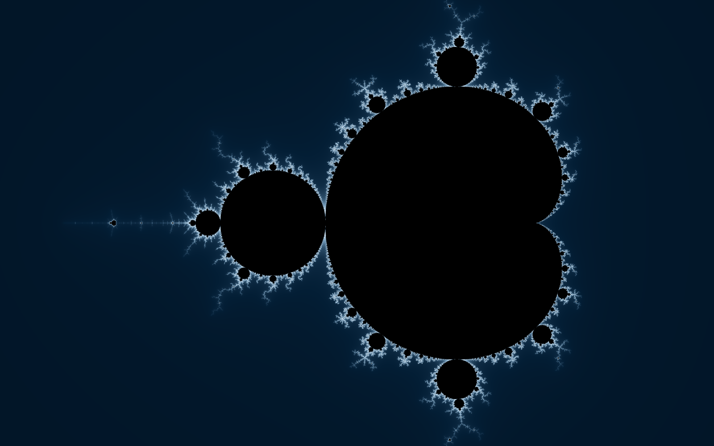
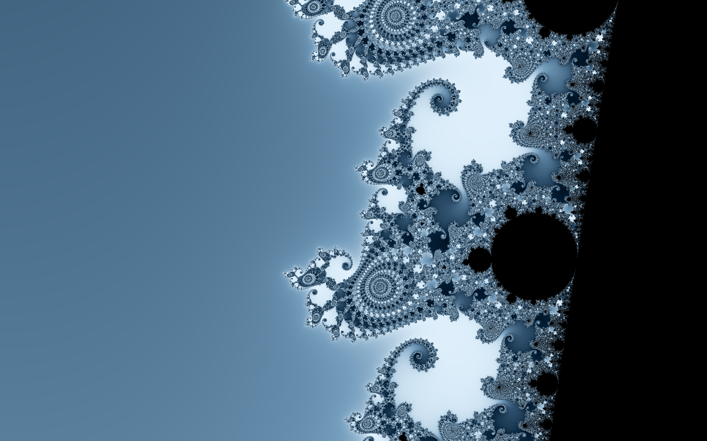

# Mandelbrot

A native macOS Mandelbrot explorer in midnight blue and black. Built with Swift, AppKit, and a parallel C rendering engine. No web view, third-party dependencies, or network connection required.



## Run it

Requires macOS 13 or later and Apple's Command Line Tools (or Xcode). The build uses the architecture of the Mac running it.

```sh
./scripts/run.sh
```

This builds and opens `build/Mandelbrot.app`. You can copy that app into your Applications folder. You can also open `Package.swift` in Xcode.

To build without launching:

```sh
./scripts/build-app.sh
```

The local app is ad-hoc signed. Public distribution will need an appropriate release signing and notarization setup.

## Explore

| Action | Control |
| --- | --- |
| Pan | Drag the image, or use arrow keys with the image focused |
| Zoom at the pointer | Mouse wheel or trackpad scroll; trackpad pinch |
| Dive into a point | Double-click |
| Zoom out from a point | Option-double-click |
| Zoom in / out at center | `+` / `−`, or `⌘=` / `⌘−` |
| Return to the whole set | Reset or `⌘0` |
| Back / forward | Buttons or `⌘[` / `⌘]` |
| Open a saved view | `⌘O` |
| Save a view | `⌘S` |
| Save as a new view | `⇧⌘S` |
| Export an image | `⌘E` |
| Choose window size | Window size or `⌥⌘R` |
| Full screen | `⌃⌘F` |

The inspector offers five starting places, exact real/imaginary center coordinates, horizontal span, three blue palettes, color spread, and detail settings from 400 to 20,000 iterations. At deep zooms, increase detail if the boundary looks solid. You can enter scientific notation in coordinate fields, then click **Go to coordinates**.

Each drag, scroll, or pinch gesture is one history entry. Navigation history is kept for the current session, up to 150 entries. Save a view before closing the app to keep your place.

## Window and image sizes

Window sizes are measured in macOS points and include the inspector. Choose a preset or custom width/height; oversized windows fit to the current display. The minimum content size is 900 × 640. Normal dragging, resizing, and full-screen mode also work.

Image export is independent of the window. Choose PNG or JPEG, a preset (including 4K, 8K, square, and ultrawide), or custom dimensions from 64 to 8,192 pixels per side, up to 40 megapixels total. JPEG quality is adjustable. Smooth edges uses four samples per pixel.

Exports retain the exact center and horizontal span. A taller image shows more of the complex plane above and below; a wider aspect ratio shows less. The export dialog previews that framing. Use **Match explorer aspect** for the same composition as the window.

Exports render in the background with progress and cancellation, then write the file atomically. **Show in Finder** reveals the finished image. PNG and JPEG contain just the fractal, without interface elements.

## Saved views

`.mandelbrot` files are portable, readable JSON. They retain:

- Center coordinates and horizontal span at full double precision
- Iteration limit, palette, and color spread
- Export size, format, JPEG quality, and smooth-edge setting
- Window content dimensions

Open a view from the app or double-click its file in Finder. Loading restores its window size, fitted to the current screen. An invalid or unsupported file produces an error without changing the active view. Files are versioned; the current schema is version 1. See [the example view](examples/seahorse-valley.mandelbrot).

## Rendering and precision

The engine uses double-precision escape-time iteration, analytic tests for the main cardioid and period-two bulb, smooth coloring, and parallel row tiles. Interaction immediately reprojects the previous frame, renders a quick preview, then refines at the window's backing resolution (up to six megapixels). Obsolete renders cancel cooperatively.

Horizontal span is limited to `1e-11`–`12`, giving a maximum magnification of approximately 340 billion times relative to the initial view. This is a practical double-precision explorer; arbitrary-precision and perturbation rendering are not implemented. Deep views and large exports take more time, especially with high iteration limits or smooth edges enabled.



## Develop and verify

```sh
swift run -c release MandelbrotChecks
./scripts/build-app.sh
```

The standalone test runner works with Command Line Tools without requiring XCTest or a full Xcode installation. It checks known set membership, conjugate symmetry, anchored zoom, aspect-correct panning, history branching, saved-view round trips and precision, invalid input, export limits, actual PNG/JPEG decoding, deterministic rendering, and cancellation.

Render a reproducible sample with the same production engine:

```sh
.build/release/Mandelbrot --render /tmp/mandelbrot.png
.build/release/Mandelbrot --render /tmp/seahorse.jpg 1
```

The optional final argument selects a starting place from `0` to `4`. The command renders at 1600 × 1000 with four samples per pixel.

| Path | Purpose |
| --- | --- |
| `Sources/FractalEngine` | C iteration, palettes, and cancellation |
| `Sources/MandelbrotCore` | View state, history, files, rendering, and image encoding |
| `Sources/MandelbrotApp` | Native AppKit window, canvas, menus, and dialogs |
| `Tests/MandelbrotCoreTests` | Dependency-free test runner |
| `Resources` | App metadata and generated icon |
| `scripts` | App bundle build and launch scripts |

GitHub Actions builds, checks, and packages the app on macOS. Publishing a release and choosing a project license are separate next steps.
